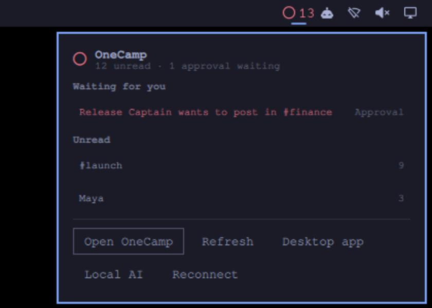

# OneMana kit for Omarchy

Your [OneCamp](https://onemana.dev) workspace on the [Omarchy](https://omarchy.org) bar.



- **What is waiting for you, at a glance.** The OneCamp ring on the bar shows your
  unread messages, and turns red when an AI agent is waiting for your approval.
  Click for the list; click a line to open it.
- **A notification when an agent needs you.** One per new approval, nothing else.
- **One-step setup.** Install the OneCamp desktop app (its signature is checked
  before it runs), or run AI on this computer with Ollama and the model OneCamp
  uses by default, `qwen3:4b-instruct`.

OneCamp is your team's chat, docs, tasks and calls in one app that runs on your own
server, with AI agents that can only do what you can. Open source, free for up to 25
people.

## Install

```
omarchy plugin add https://github.com/OneMana-Soft/onemana-omarchy --enable
```

Then click the ring on the bar and choose **Connect your workspace**. You need:

1. Your workspace's address, for example `onecamp.yourcompany.com`.
2. A personal API token with the scope `attention:read`, created at
   `<your workspace>/app/settings/api-tokens`. That scope reads what is waiting
   for you (unread counts, approvals, overdue tasks) and nothing else.

No workspace yet? **Start free** opens [onemana.dev/free](https://onemana.dev/free),
or try the [live demo](https://onemana.dev).

## Using it

| On the bar | Does |
|---|---|
| Click | Show what is waiting |
| Right-click | Open OneCamp |
| Middle-click | Refresh now |

From a keybinding or a script:

```
omarchy shell dev.onemana.onecamp toggle
omarchy shell dev.onemana.onecamp status   # JSON: unread, approvals, overdue, error
```

Settings (Omarchy's bar settings): how often to check (default every 60 seconds,
never more often than every 30) and whether to notify about new approvals.

## How it handles your token

`connect` stores the workspace address in `~/.config/onemana/onecamp.conf` and the
token as an `Authorization` header in `~/.config/onemana/onecamp.header`, mode 600.
curl reads the header from that file, so the token never appears in a process list
or your shell history. To disconnect, delete the two files and revoke the token in
OneCamp.

## Requirements

- Omarchy 4 or later.
- A OneCamp workspace on a release with `/v1/unread` (OneCamp v2.42.0 or v1.27.0
  and later). Approvals and overdue tasks need the AI edition (v2); without it the
  bar shows unread messages alone.
- For the desktop app: `minisign` (`sudo pacman -S minisign`), used to check the
  download against the app's signing key.

## Develop

```
scripts/validate.sh   # manifest, scripts, unit tests; Omarchy's own checks on an Omarchy machine
```

MIT licensed. Made by [OneMana](https://onemana.dev).
